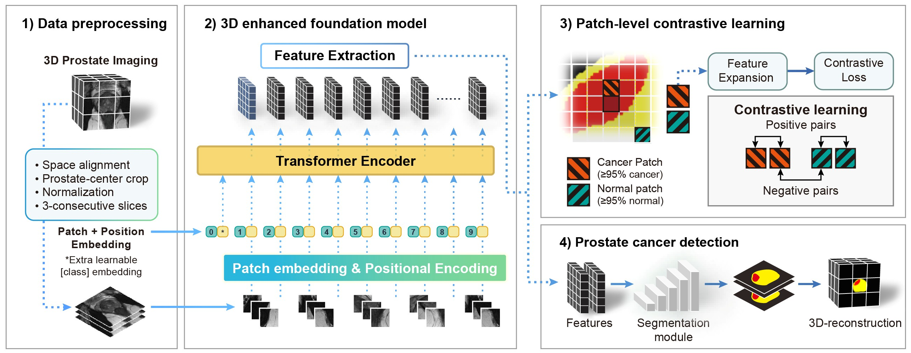
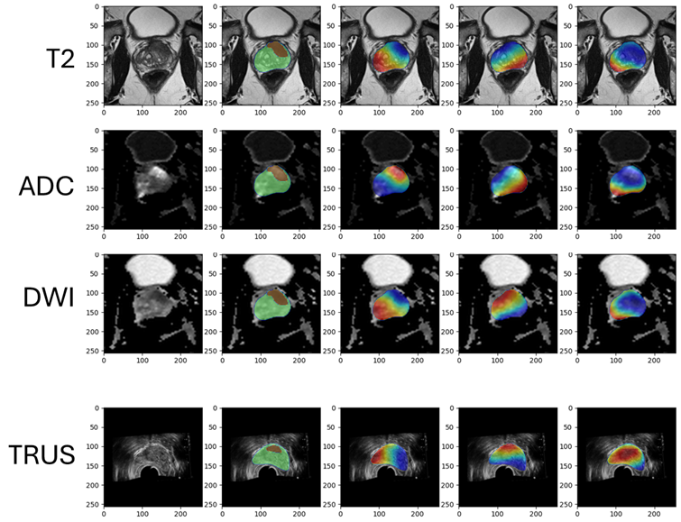
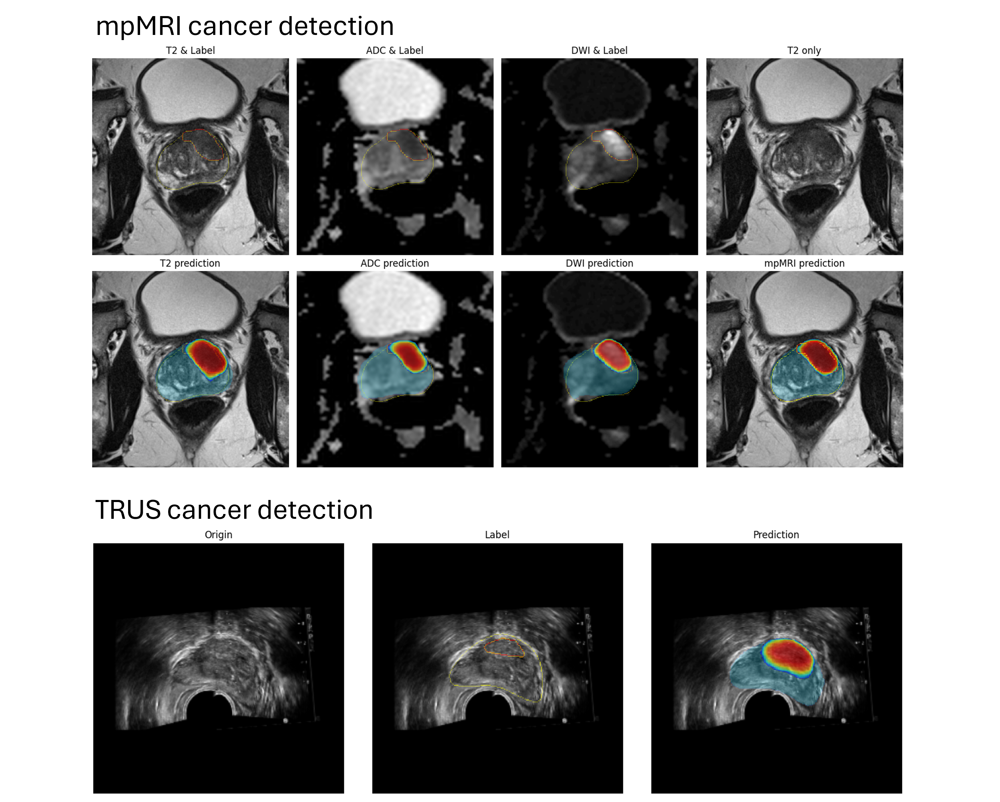

# ProViCNet  
**Prostate-Specific Foundation Models for Enhanced Detection of Clinically Significant Cancer**  

## Overview  
ProViCNet is an organ-specific foundation model designed for prostate cancer detection using multimodal medical imaging data. The model leverages the power of vision transformers and contrastive learning to achieve robust performance across different imaging modalities (mpMRI and TRUS).  

📄 **Reference Paper:** [ProViCNet: Organ-Specific Foundation Model for Prostate Cancer Detection](https://doi.org/10.48550/arXiv.2502.00366)  


## Features
- 🔥 Pre-trained on mpMRIs and TRUS modalities
- 🎯 Patch-level feature extraction capabilities
- 🖼️ Segmentation prediction for cancer regions
- 📊 Visualization tools for analysis




## Installation
Before installing dependencies, install PyTorch based on your system configuration.

```bash
# Clone the repository
git clone https://github.com/pimed/ProViCNet.git
cd ProViCNet

# Create a conda environment
conda create -n provicnet python=3.8
conda activate provicnet

# Install required packages
pip install -r requirements.txt
```


## Model Architecture
ProViCNet consists of two main components:
1. **Feature Extractor**: Based on DINOv2 vision transformer architecture + Patch-level contrastive learning
2. **Segmentation Head**: Specialized decoder for precise cancer region delineation

## Usage

### Multi-parametric MRI (mpMRI) Analysis

```bash
python inference_mpMRI.py \
    --ModelName ProViCNet \
    --vit_backbone dinov2_s_reg \
    --img_size 448 \
    --config_file config_MRI.yaml
```

### Transrectal Ultrasound (TRUS) Analysis

```bash
python inference_TRUS.py \
    --ModelName ProViCNet \
    --vit_backbone dinov2_s_reg \
    --img_size 448 \
    --config_file config_TRUS.yaml
```

## Additional Configuration

- **--nClass**: Number of segmentation classes (default: 4). The classes are:  
  - 0: Background  
  - 1: Normal prostate gland  
  - 2: Indolent prostate cancer  
  - 3: Clinically significant prostate cancer (csPCa)  
- **--nChannel**: Number of input channels (consecutive slices; default: 9).
- **--contrastive**: Enable (1) or disable (0) contrastive learning (default: 1).
- **--cuda_device**: CUDA device index to use (default: 0).
- **--only_csPCa**: If `True`, keeps only clinically significant prostate cancer (csPCa); otherwise, merges cancer channels.
- **--save_folder**: Directory to save predicted outputs (default: `results_ProViCNet/`).
- **--visualization_folder**: Directory to save visualization images (default: `visualization_ProViCNet/`).
- **--threshold**: Probability threshold for converting outputs into binary labels (default: 0.4).
- **--small_batchsize**: Batch size for inference (default: 16).


## Model Load

The model is initialized using the `GetModel` function, which loads the appropriate architecture based on the given arguments.

# Model Load

model_config:
```bash
# Model initialization
MODEL = GetModel( \
    args.ModelName, \
    args.nClass, \
    args.nChannel, \
    args.img_size, \
    vit_backbone=args.vit_backbone, \
    contrastive=args.contrastive, \
    US=args.US \
)
```

## Arguments
- **args.ModelName**: Specifies the model architecture (e.g., "ProViCNet", "ProViDNet", "UCTransNet")
- **args.nClass**: Number of segmentation classes (default: 4). The classes are:  
  - 0: Background  
  - 1: Normal prostate gland  
  - 2: Indolent prostate cancer  
  - 3: Clinically significant prostate cancer (csPCa)  
- **args.nChannel**: Number of input channels (default: 9, for multi-slice MRI inputs)
- **args.img_size**: Input image resolution (e.g., 448 for ProViCNet, 256 for other models)
- **args.vit_backbone**: Specifies the Vision Transformer (ViT) backbone used for feature extraction
- **args.contrastive**: Enable (1) or disable (0) contrastive learning
- **args.US**: Indicates whether ultrasound (US) modality is used

## Feature Extraction & Analysis

### Patch-level Feature Extraction
ProViCNet can extract meaningful features at the patch level using its transformer backbone:

```python
# Extract patch tokens
Tokens_T2 = getPatchTokens(model, Image_T2, Posit, args)
Tokens_ADC = getPatchTokens(model, Image_ADC, Posit, args)
Tokens_DWI = getPatchTokens(model, Image_DWI, Posit, args)

# Visualize feature maps
visualize_featuremap(Tokens_T2, Image_T2, Label, save_path)
```




### Segmentation Prediction
The model provides comprehensive cancer region segmentation:

```python
# Get predictions
preds_T2, preds_ADC, preds_DWI, preds_MP = ProViCNet_Inference(
    Image_T2, Image_ADC, Image_DWI, Posit, args, Models, Model_Fusion)

# Save results
saveData(preds_MP_softmax[:, 2], filename, save_path)
```



## Sample Data
The repository includes example cases for both modalities:

### mpMRI Sample
- Source: [PI-CAI Challenge](https://pi-cai.grand-challenge.org/)
- Location: `dataset_MRI/`
- Contains: Single case with T2W, ADC, DWI sequences and corresponding annotations

### TRUS Sample
- Source: [The Cancer Imaging Archive (TCIA)](https://www.cancerimagingarchive.net/collection/prostate-mri-us-biopsy/)
- Location: `dataset_TRUS/`
- Contains: Single case with TRUS images and biopsy-confirmed annotations

## Model Weights
Pre-trained weights are automatically downloaded from Hugging Face Hub:
- MRI Weights: [pimed/ProViCNet](https://huggingface.co/pimed/ProViCNet)
  - T2W, ADC, DWI, and Fusion models
- TRUS Weights: [pimed/ProViCNet](https://huggingface.co/pimed/ProViCNet)
  - TRUS-specific model

## Directory Structure
```
ProViCNet/
├── config_MRI.yaml        # Configuration for MRI inference
├── config_TRUS.yaml      # Configuration for TRUS inference
├── dataset_MRI/          # Sample MRI dataset
├── dataset_TRUS/         # Sample TRUS dataset
├── inference_mpMRI.py    # MRI inference script
├── inference_TRUS.py     # TRUS inference script
├── ProViCNet/           # Core model implementation
├── results_ProViCNet/    # Output directory
└── visualization_ProViCNet/ # Visualization outputs
```

## Citation
If you use ProViCNet in your research, please cite:
```bibtex
@article{provicnet2024,
  title={ProViCNet: Organ-specific Foundation Model for Prostate Cancer Detection},
  author={Your Name},
  journal={arXiv preprint},
  year={2024}
}
```

## License
This project is licensed under the MIT License - see the [LICENSE](LICENSE) file for details.

## Acknowledgments
- [PI-CAI Challenge](https://pi-cai.grand-challenge.org/) for the mpMRI dataset  
  - **Reference**: Saha, Anindo, et al. "Artificial intelligence and radiologists at prostate cancer detection in MRI—the PI-CAI challenge." *Medical Imaging with Deep Learning, short paper track*. 2023.
- [The Cancer Imaging Archive (TCIA)](https://www.cancerimagingarchive.net/collection/prostate-mri-us-biopsy/) for the TRUS dataset  
  - **Reference**: Natarajan, S., et al. "Prostate MRI and ultrasound with pathology and coordinates of tracked biopsy (prostate-MRI-US-biopsy)." *The Cancer Imaging Archive* 10 (2020): 7937.
- DINOv2 team for the vision transformer backbone
